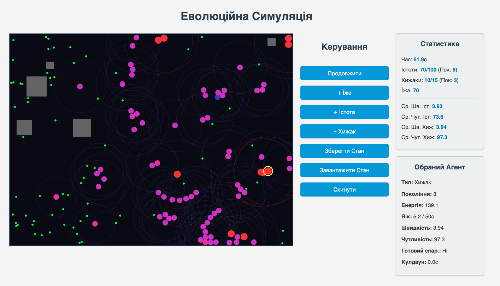

# Еволюційна Симуляція (Веб Версія)

Це 2D симуляція, що демонструє принципи еволюції та взаємодії між популяціями, реалізована за допомогою HTML, CSS та JavaScript з використанням Canvas API. Вона включає два типи агентів: "Істоти" (умовні травоїдні) та "Хижаки", які взаємодіють між собою та з навколишнім середовищем (їжа, перешкоди). Агенти еволюціонують, змінюючи свої гени (швидкість, чутливість) через покоління.

## Особливості

*   **Візуалізація на Canvas:** Симуляція відображається на HTML5 Canvas.
*   **Агенти:**
    *   **Істоти:** Шукають їжу, розмножуються статевим шляхом (з пошуком партнера та схрещуванням генів), намагаються уникати хижаків та скупчення, уникають стін.
    *   **Хижаки:** Полюють на Істот, розмножуються асексуально (з кулдауном та мутаціями), уникають скупчення та стін.
*   **Середовище:**
    *   **Їжа:** З'являється випадково (уникаючи перешкод), споживається Істотами.
    *   **Перешкоди:** Статичні прямокутники, смертельні при контакті.
*   **Еволюція:**
    *   **Гени:** Швидкість руху та радіус чутливості (поле зору).
    *   **Розмноження:** Статеве для істот, асексуальне для хижаків.
    *   **Мутації:** Випадкові зміни генів при народженні нащадка.
    *   **Відбір:** Природний (голод, старість, хижаки, перешкоди) та статевий (для істот).
*   **Поведінка:**
    *   Рух до цілі (їжа, здобич, партнер).
    *   Ухилення від хижаків (Істоти).
    *   Уникнення скупчення (Separation).
    *   Уникнення стін (Wall Avoidance).
    *   Випадкове блукання при відсутності цілі.
*   **Життєвий Цикл:** Енергія, вік, смерть.
*   **Відстеження Поколінь:** Облік максимального покоління для кожного виду.
*   **Збереження/Завантаження:** Використовує `localStorage` браузера для збереження та відновлення стану симуляції.
*   **Інтерфейс:**
    *   Кнопки для керування симуляцією (пауза, додавання елементів, збереження/завантаження, скидання).
    *   Панель зі статистикою популяцій, середніх генів та часу симуляції.
    *   Панель для відображення деталей обраного кліком миші агента.
*   **Візуалізація Чутливості:** Напівпрозорі кола показують радіус сприйняття агентів.

## Скріншот

<!-- Додайте сюди скріншот вашої симуляції! -->

## Як Запустити

1.  **Клонуйте репозиторій або завантажте файли:** `index.html`, `style.css`, `script.js`.
2.  **Відкрийте `index.html` у вашому веб-браузері.** Симуляція повинна запуститися автоматично.

**Примітка:** Оскільки симуляція використовує `localStorage` для збереження, стан буде прив'язаний до конкретного браузера, в якому ви її відкрили.

## Управління

*   **Кнопка "Пауза / Продовжити"**: Зупиняє/відновлює симуляцію.
*   **Кнопка "+ Їжа"**: Додає порцію їжі на поле.
*   **Кнопка "+ Істота"**: Додає нову Істоту (до ліміту).
*   **Кнопка "+ Хижак"**: Додає нового Хижака (до ліміту).
*   **Кнопка "Зберегти Стан"**: Зберігає поточний стан симуляції у `localStorage` (працює лише на паузі).
*   **Кнопка "Завантажити Стан"**: Завантажує останній збережений стан з `localStorage`.
*   **Кнопка "Скинути"**: Скидає симуляцію до початкового стану (потрібне підтвердження).
*   **Клік Мишею на Канві**: Вибирає агента (Істоту або Хижака) для відображення його характеристик в інформаційній панелі. Клік на порожнє місце знімає вибір.

## Використані Технології

*   HTML5 (Структура сторінки, елемент `<canvas>`)
*   CSS3 (Стилізація, розміщення Flexbox)
*   JavaScript (ES6+) (Вся логіка симуляції, взаємодія з DOM, Canvas 2D API, `localStorage`)

## Можливі Покращення

*   **Графіки Динаміки:** Інтеграція бібліотеки (напр., Chart.js) для візуалізації змін популяцій та генів з часом.
*   **Оптимізація Продуктивності:** Впровадження просторових структур (Quadtree) для пришвидшення пошуку найближчих сусідів/цілей при великій кількості агентів.
*   **Покращена Групова Поведінка:** Додавання правил Alignment та Cohesion для більш реалістичного стайного руху.
*   **Статеве Розмноження Хижаків:** Реалізація пошуку партнера та схрещування для хижаків.
*   **Налаштування Параметрів:** Додавання елементів керування в інтерфейсі для зміни параметрів симуляції (швидкості, радіусів, вартості енергії тощо) без редагування коду.
*   **Збереження у Файл:** Додавання можливості експорту/імпорту стану симуляції у вигляді файлу.
*   **Різні Типи Ресурсів/Місцевості:** Ускладнення середовища.